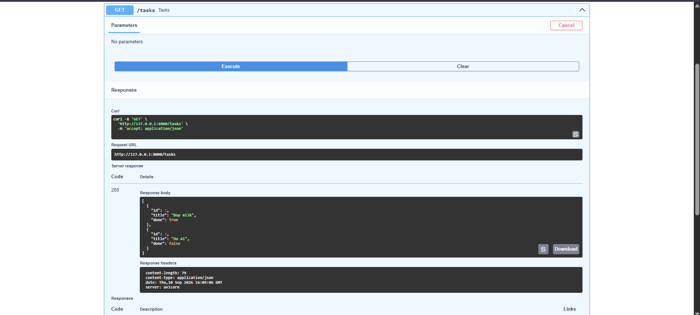
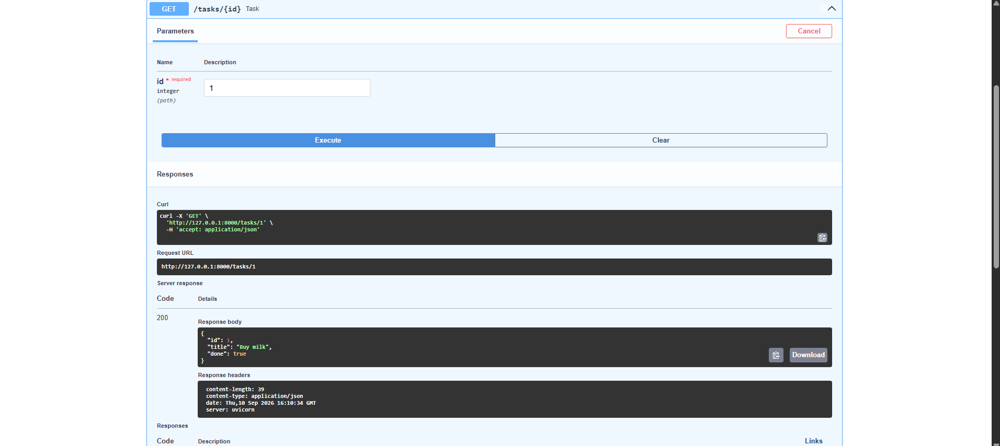
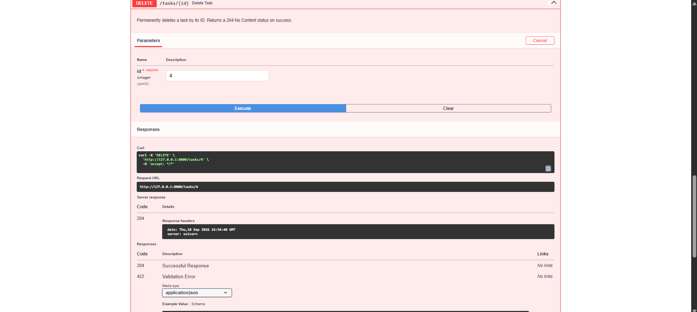
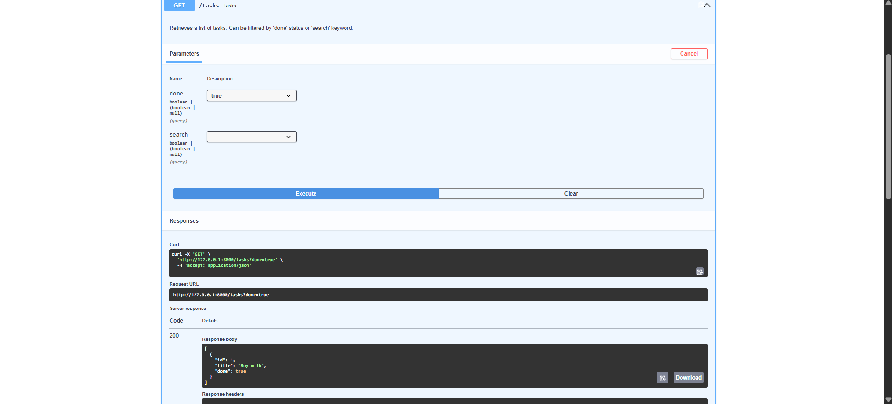
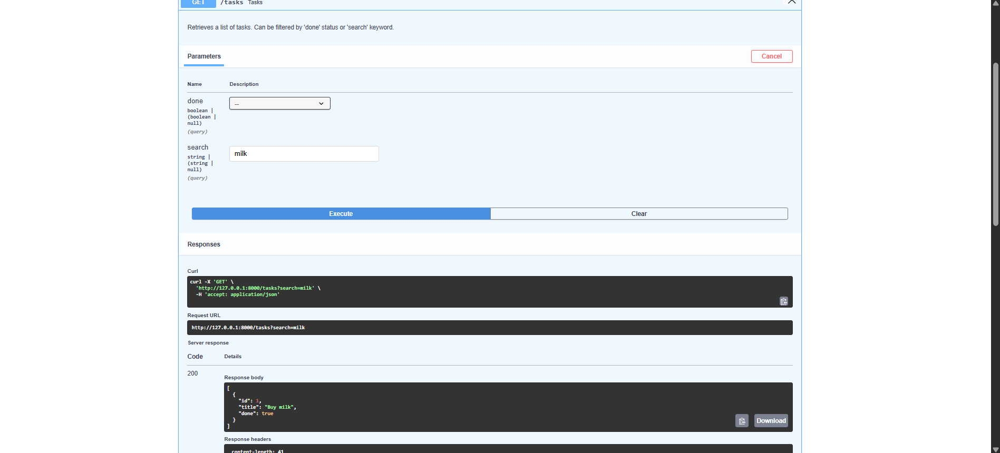
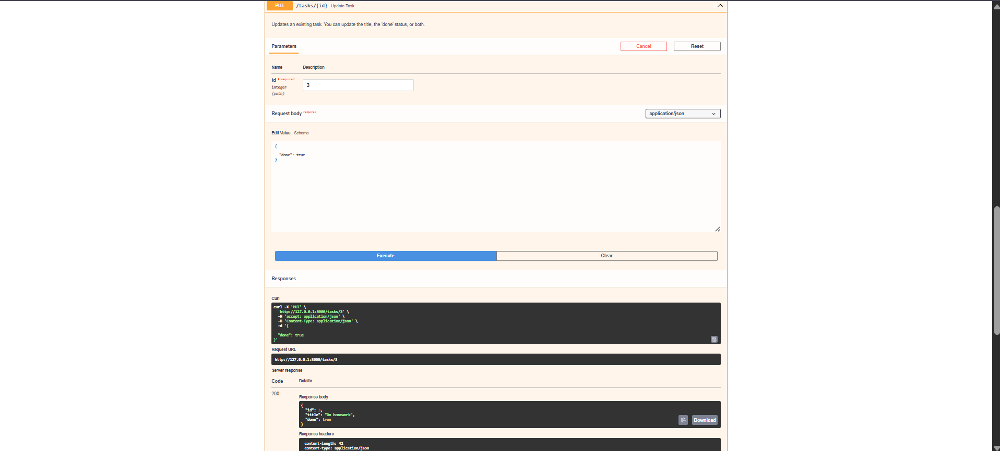
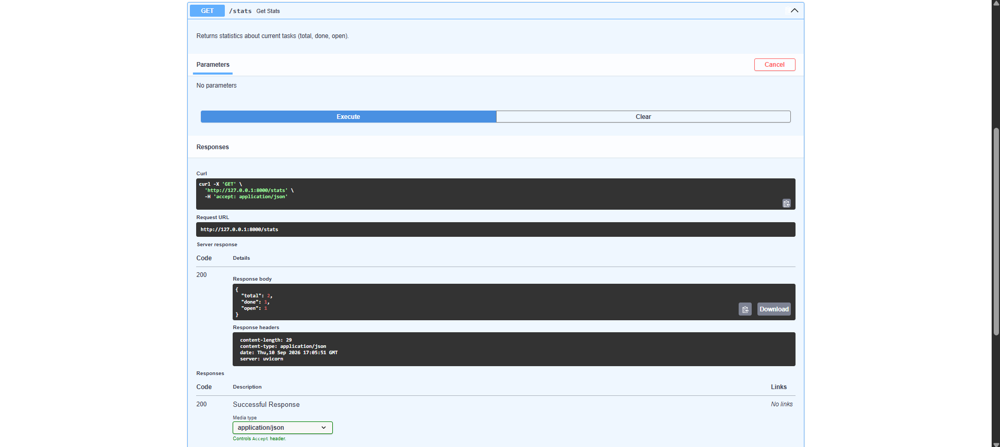

# To-Do List API - Flyrank Internship (Assignment 1)

**Track:** Backend AI Engineering Track

## 📌 What This Is
This is a fully functional RESTful API built with **FastAPI** in Python. It provides complete CRUD (Create, Read, Update, Delete) operations for managing tasks. 

The project architecture follows the **Separation of Concerns** principle, dividing the logic into modular layers:
* `routers.py` (Controllers for routing)
* `services.py` (Business logic and filtering)
* `schemas.py` (Pydantic DTOs for request validation)
* `storage.py` (Data storage and manipulation)

### 🧪 The Mortality Experiment (In-Memory Storage)
Currently, this API uses an **in-memory Python dictionary** to store tasks. This means that data only lives as long as the server process is running. If you restart the server, all created tasks are instantly wiped out, and the database resets to its initial seed state. 
*Observation:* This "mortality" of data highlights the absolute necessity of integrating a persistent database (like PostgreSQL or MySQL) for production applications.

---

## 🚀 How to Install & Run It

To run the live server with auto-reload enabled, use the following FastAPI CLI command in your terminal:

```bash
fastapi dev main.py
```
*The API will be available at `http://localhost:8000`*

---

## 🗺️ Endpoints Table

| Method | Endpoint | Description |
| :--- | :--- | :--- |
| **GET** | `/` | Returns API metadata and version. |
| **GET** | `/health` | Server health check (returns `{"status": "ok"}`). |
| **GET** | `/tasks` | Retrieves all tasks. Supports optional query parameters `?done=true/false` and `?search=keyword` for filtering. |
| **GET** | `/tasks/{id}` | Retrieves a specific task by its unique ID. Returns 404 if not found. |
| **POST** | `/tasks` | Creates a new task. Requires a `title`. Generates an auto-incremented ID and sets `done` to `false`. |
| **PUT** | `/tasks/{id}` | Updates an existing task's `title` and/or `done` status. |
| **DELETE** | `/tasks/{id}` | Deletes a task by its ID. Returns 204 No Content. |
| **GET** | `/stats` | Returns statistics about current tasks (total, done, open). |

---

## 💻 Terminal Test (cURL)

Here is an example of fetching all tasks using `curl` with headers included:

```bash
curl -i http://localhost:8000/tasks
```

**Output:**
```http
HTTP/1.1 200 OK
date: Thu, 10 Sep 2026 17:15:13 GMT
server: uvicorn
content-length: 79
content-type: application/json

[{"id":1,"title":"Buy milk","done":true},{"id":2,"title":"Do A1","done":false}]
```

---

## 📸 Interactive Documentation (Swagger UI)

FastAPI automatically generates interactive API documentation. You can test all endpoints directly from your browser by navigating to `/docs`.









*(Includes statistics, filtering, and full CRUD testing directly via Swagger)*